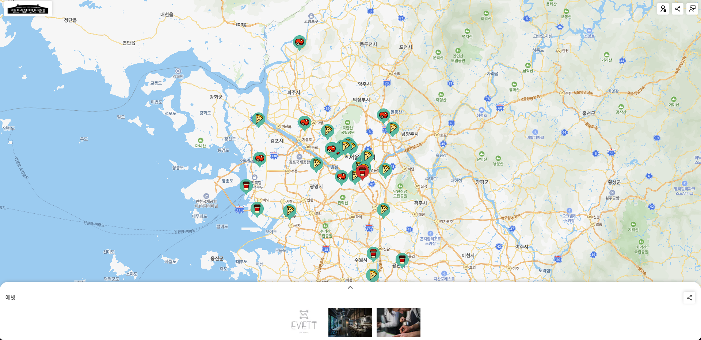
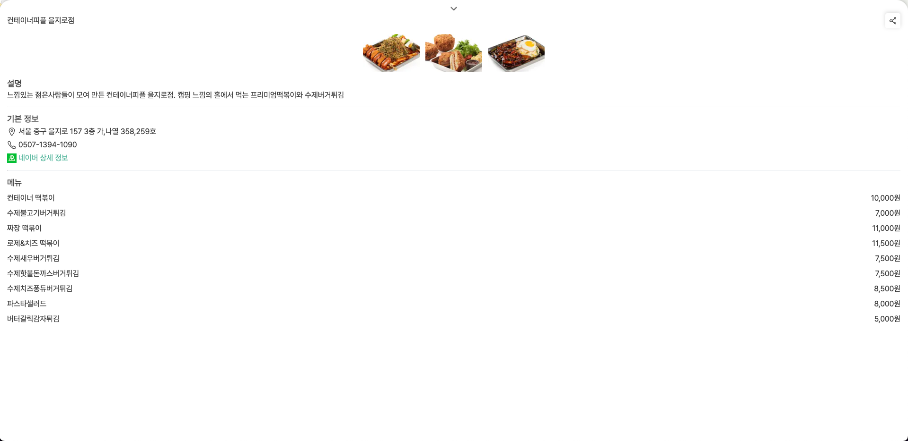
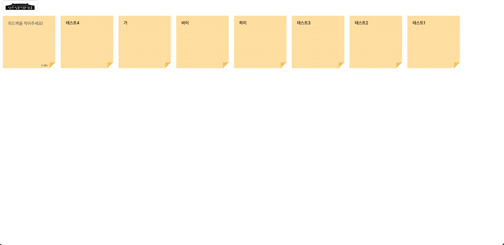
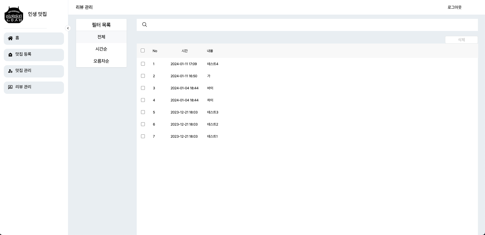

<p align="center">
  
</p>
</br>

<p align="center">
    <strong style='font-size:25px'>인생맛집 추천 웹 서비스</strong>
</p>

</br>

<div style='display:flex'> 
    
  
</div>

<div style='display:flex'> 
    
  
</div>

## 폴더구조 
```
📦
├─ .babelrc
├─ .env
├─ .eslintrc.json
├─ .gitignore
├─ .prettierrc.json
├─ .swcrc
├─ README.md
├─ components
│  ├─ common
│  │  ├─ Button.tsx
│  │  ├─ DashBordLayout.tsx
│  │  ├─ GlobalModal.tsx
│  │  ├─ Header.tsx
│  │  ├─ LabelInput.tsx
│  │  ├─ Portal.tsx
│  │  ├─ SideBar.tsx
│  │  ├─ SideBarLayout.tsx
│  │  ├─ Table.tsx
│  │  └─ TableBody.tsx
│  ├─ feedback
│  │  ├─ FeedbackList.tsx
│  │  ├─ FeedbackSection.tsx
│  │  ├─ FeedbackSubmitButton.tsx
│  │  └─ NewFeedInput.tsx
│  └─ home
│     ├─ DetailContent.tsx
│     ├─ DetailHeader.tsx
│     ├─ DetailSection.tsx
│     ├─ Header.tsx
│     ├─ Makers.tsx
│     ├─ Map.tsx
│     ├─ MapSection.tsx
│     └─ Marker.tsx
├─ firebase
│  ├─ feedback.ts
│  └─ index.ts
├─ hooks
│  ├─ useCheckboxes.tsx
│  ├─ useCurrentStore.tsx
│  ├─ useInput.ts
│  ├─ useInputs.ts
│  ├─ useMap.tsx
│  ├─ useModals.tsx
│  ├─ useRouters.tsx
│  ├─ useSearch.tsx
│  ├─ useStores.ts
│  └─ useToast.tsx
├─ lib
│  └─ registry.tsx
├─ next-sitemap.config.js
├─ next.config.js
├─ package.json
├─ pages
│  ├─ 404.tsx
│  ├─ Providers.tsx
│  ├─ [name].tsx
│  ├─ _app.tsx
│  ├─ _document.tsx
│  ├─ admin
│  │  ├─ dashboard
│  │  │  └─ index.tsx
│  │  ├─ index.tsx
│  │  ├─ management
│  │  │  └─ index.tsx
│  │  ├─ registration
│  │  │  └─ index.tsx
│  │  └─ review
│  │     ├─ ContentPage.tsx
│  │     ├─ FilterPage.tsx
│  │     ├─ SearchPage.tsx
│  │     └─ index.tsx
│  ├─ api
│  │  ├─ hello.ts
│  │  └─ stores.ts
│  ├─ feedback.tsx
│  └─ index.tsx
├─ public
│  ├─ favicon.png
│  ├─ images
│  │  ├─ markers-selected.png
│  │  ├─ markers.png
│  │  └─ naver.png
│  ├─ logo.jpeg
│  ├─ robots.txt
│  ├─ sitemap-0.xml
│  ├─ sitemap.xml
│  └─ stores.json
├─ recoil
│  └─ admin
│     └─ atom.ts
├─ seo.config.js
├─ styles
│  ├─ GlobalStyles.ts
│  ├─ admin
│  │  ├─ adminDashBord.tsx
│  │  └─ adminLogin.tsx
│  ├─ common.module.scss
│  ├─ detail.module.scss
│  ├─ feedback.module.scss
│  ├─ fonts.scss
│  ├─ globals.scss
│  ├─ header.module.scss
│  ├─ map.module.scss
│  └─ theme.ts
├─ tsconfig.json
├─ types
│  ├─ common.ts
│  ├─ feedback.ts
│  ├─ map.ts
│  ├─ store.ts
│  ├─ styled.d.ts
│  └─ toast.ts
├─ utils
│  ├─ common.ts
│  ├─ commonObject.ts
│  └─ feedbackColor.ts
└─ yarn.lock
```